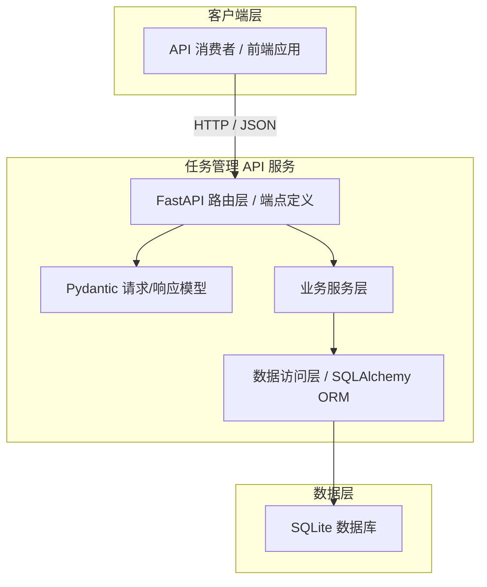

# 架构设计文档 - SD-01 RESTful 任务管理 API

## 1. 架构概述

### 1.1 架构目标

- **可扩展性**: 采用分层架构与清晰的模块边界，未来可平滑扩展为多用户系统或接入更复杂的数据库后端。
- **高可用性**: 作为轻量级单用户 API，当前以单进程部署为主，通过无状态设计支持横向扩展。
- **可维护性**: 通过 FastAPI 的依赖注入、Pydantic 模型校验与自动文档生成，降低代码冗余与维护成本。

### 1.2 架构原则

- **单一职责原则**: 每层只负责自身领域内的逻辑，路由层负责 HTTP 协议交互，服务层负责业务编排，数据访问层负责持久化操作。
- **开闭原则**: 通过抽象接口定义数据访问层，便于后续替换数据库实现而无需修改业务逻辑。
- **接口隔离原则**: 请求模型、响应模型与数据库模型分离，避免外部接口变更直接影响内部数据结构。
- **依赖倒置原则**: 业务层依赖抽象的数据访问接口，而非具体的 ORM 实现。

---

## 2. 系统架构

### 2.1 整体架构图

以下采用 C4 容器图描述本系统的核心组件及其交互关系：

### 2.2 架构分层

#### 2.2.1 表示层

- **FastAPI 路由层**: 定义所有 HTTP 端点，负责请求接收、参数解析、依赖注入与响应返回。
- **Pydantic 模型**: 负责请求体与响应体的序列化、反序列化及自动数据校验。
- **自动文档**: FastAPI 原生集成 OpenAPI 3.1 规范，通过 `/api/v1/docs` 与 `/api/v1/openapi.json` 自动暴露交互式文档。

#### 2.2.2 业务层

- **业务服务层**: 封装任务 CRUD 与列表查询的业务逻辑，协调路由层与数据访问层之间的调用。
- **查询构建器**: 负责将列表查询接口传入的过滤、分页、排序参数转换为数据库查询表达式。

#### 2.2.3 数据访问层

- **SQLAlchemy 2.0 异步会话**: 通过声明式模型映射任务数据表，提供异步数据库操作能力。
- **数据模型**: 定义任务表结构、字段约束与索引策略。

#### 2.2.4 数据层

- **SQLite**: 轻量级文件型关系型数据库，满足当前单用户场景下的数据持久化需求。

---

## 3. 服务设计

### 3.1 服务拆分

本系统为单体应用，所有功能内聚于单一服务进程中，以下为模块职责划分：

| 模块名称 | 职责 | 技术栈 |
|---------|------|--------|
| 路由模块 | 定义 HTTP 端点、处理请求/响应、注入依赖 | FastAPI APIRouter |
| 模型模块 | 定义 Pydantic Schema 与 SQLAlchemy ORM 模型 | Pydantic v2, SQLAlchemy 2.0 |
| 服务模块 | 实现业务逻辑与查询参数构建 | Python 标准库 |
| 数据访问模块 | 管理数据库会话与 CRUD 原子操作 | SQLAlchemy 2.0 AsyncSession |

### 3.2 服务间通信

本系统为单体架构，模块间通过同步 Python 函数调用进行通信，不涉及分布式服务间通信或消息队列。

### 3.3 API 设计

#### 3.3.1 创建任务

- **URL**: `/api/v1/tasks`
- **Method**: POST
- **描述**: 接收 JSON 请求体，校验通过后持久化任务并返回完整任务对象。
- **请求参数**:

| 字段名 | 类型 | 必填 | 说明 |
|--------|------|------|------|
| title | String | 是 | 任务标题，长度 1~200 字符 |
| description | String | 否 | 任务描述，最大 2000 字符 |
| status | String | 否 | 任务状态，默认 `todo`，枚举：`todo`/`in_progress`/`done` |
| priority | String | 否 | 任务优先级，默认 `medium`，枚举：`low`/`medium`/`high` |
| due_date | DateTime (ISO 8601) | 否 | 任务截止时间，UTC 格式 |

- **成功响应**: HTTP 201，响应体包含完整任务对象（含 `id`、`created_at`、`updated_at`）。

#### 3.3.2 获取任务详情

- **URL**: `/api/v1/tasks/{task_id}`
- **Method**: GET
- **描述**: 根据路径参数 `task_id` 返回对应任务的完整详情。
- **路径参数**:

| 参数名 | 类型 | 说明 |
|--------|------|------|
| task_id | Integer | 任务主键 ID |

- **成功响应**: HTTP 200，返回任务对象。
- **错误响应**: HTTP 404（任务不存在），HTTP 422（ID 格式非法）。

#### 3.3.3 更新任务

- **URL**: `/api/v1/tasks/{task_id}`
- **Method**: PUT / PATCH
- **描述**: 根据 `task_id` 更新对应任务。PUT 为全量替换，PATCH 为部分更新。
- **路径参数**:

| 参数名 | 类型 | 说明 |
|--------|------|------|
| task_id | Integer | 任务主键 ID |

- **请求参数**: 与创建任务相同，但根据方法类型决定字段必填策略。
- **成功响应**: HTTP 200，返回更新后的完整任务对象，`updated_at` 自动刷新。
- **错误响应**: HTTP 404（任务不存在），HTTP 422（字段校验失败）。

#### 3.3.4 删除任务

- **URL**: `/api/v1/tasks/{task_id}`
- **Method**: DELETE
- **描述**: 根据 `task_id` 物理删除对应任务。
- **路径参数**:

| 参数名 | 类型 | 说明 |
|--------|------|------|
| task_id | Integer | 任务主键 ID |

- **成功响应**: HTTP 204，无响应体。
- **错误响应**: HTTP 404（任务不存在），HTTP 422（ID 格式非法）。

#### 3.3.5 获取任务列表

- **URL**: `/api/v1/tasks`
- **Method**: GET
- **描述**: 返回符合条件的任务列表，支持多条件过滤、分页与单字段排序。
- **查询参数**:

| 参数名 | 类型 | 必填 | 默认值 | 说明 |
|--------|------|------|--------|------|
| status | String | 否 | — | 按状态过滤，支持逗号分隔多值，多值间为 OR 关系 |
| priority | String | 否 | — | 按优先级过滤，支持逗号分隔多值，多值间为 OR 关系 |
| due_date_from | DateTime | 否 | — | 截止时间起始范围（包含） |
| due_date_to | DateTime | 否 | — | 截止时间结束范围（包含） |
| created_at_from | DateTime | 否 | — | 创建时间起始范围（包含） |
| created_at_to | DateTime | 否 | — | 创建时间结束范围（包含） |
| page | Integer | 否 | 1 | 当前页码，最小值为 1 |
| page_size | Integer | 否 | 20 | 每页记录数，最大值为 100 |
| sort_by | String | 否 | created_at | 排序字段，支持：`title`、`status`、`priority`、`due_date`、`created_at`、`updated_at` |
| sort_order | String | 否 | desc | 排序方向，支持：`asc`、`desc` |
- **成功响应**: HTTP 200，响应体采用 `items` + `pagination` 包装结构，包含任务对象数组与分页元数据。
- **分页元数据字段**:

| 字段名 | 类型 | 说明 |
|--------|------|------|
| page | Integer | 当前页码 |
| page_size | Integer | 每页记录数 |
| total | Integer | 总记录数 |
| total_pages | Integer | 总页数 |

- **过滤逻辑**: 不同字段间的过滤条件为 AND 关系；同一字段内的多值为 OR 关系。

### 3.4 错误响应设计
系统统一采用 FastAPI / Pydantic 默认错误响应结构。

- **HTTP 422 字段级校验错误**: 响应体包含 `detail` 数组，每个元素包含 `loc`（错误位置）、`msg`（错误描述）、`type`（错误类型）字段。
- **HTTP 404 资源不存在**: 响应体包含 `detail` 字段，指明对应任务 ID 未找到。
- **HTTP 400 请求体解析失败**: 响应体包含 `detail` 字段，提示请求体无法解析。
---

## 4. 数据架构

### 4.1 数据存储策略

- **关系型数据库 SQLite**: 存储任务主数据，利用关系型数据库的 ACID 特性保障数据一致性。
- **时区策略**: 所有日期时间字段在数据库中以 UTC 存储，接口层以 ISO 8601 格式字符串交互，响应中附带 `Z` 后缀。

### 4.2 数据库设计

#### 4.2.1 任务表（tasks）

| 字段名 | 数据类型 | 约束 | 默认值 | 说明 |
|--------|---------|------|--------|------|
| id | INTEGER | PRIMARY KEY, AUTOINCREMENT | — | 唯一标识，不可修改 |
| title | VARCHAR(200) | NOT NULL | — | 任务标题 |
| description | TEXT | NULL | NULL | 任务详细描述，最大 2000 字符 |
| status | VARCHAR(20) | NOT NULL | 'todo' | 枚举：`todo`/`in_progress`/`done` |
| priority | VARCHAR(20) | NOT NULL | 'medium' | 枚举：`low`/`medium`/`high` |
| due_date | DATETIME | NULL | NULL | 截止时间，UTC 存储 |
| created_at | DATETIME | NOT NULL | CURRENT_TIMESTAMP | 创建时间戳 |
| updated_at | DATETIME | NOT NULL | CURRENT_TIMESTAMP | 最后更新时间戳，每次更新自动刷新 |

#### 4.2.2 索引设计

| 索引名称 | 字段 | 类型 | 说明 |
|---------|------|------|------|
| idx_tasks_status | status | 普通索引 | 加速状态过滤查询 |
| idx_tasks_priority | priority | 普通索引 | 加速优先级过滤查询 |
| idx_tasks_due_date | due_date | 普通索引 | 加速截止时间范围查询 |
| idx_tasks_created_at | created_at | 普通索引 | 加速创建时间范围查询与默认排序 |

### 4.3 数据一致性

- **强一致性场景**: 任务的创建、更新、删除操作均通过 SQLAlchemy 异步事务保证，确保数据库状态即时生效。
- **物理删除策略**: 删除操作直接移除数据库记录，不保留历史数据，满足简单场景需求。

---

## 5. 设计决策记录

| 决策项 | 决策内容 | 理由 |
|--------|---------|------|
| 用户认证机制 | 当前版本不提供用户认证 | 需求明确为单用户开放 API，降低复杂度 |
| 更新接口方式 | 同时支持 PUT 全量替换与 PATCH 部分更新 | 提供更灵活的客户端集成方式 |
| 删除策略 | 采用物理删除 | 需求定位轻量级，物理删除实现简单直接 |
| 分页响应结构 | 采用 `items` + `pagination` JSON 包装体 | 结构清晰，便于前端统一解析 |
| 排序能力 | 仅支持单字段排序 | 满足当前需求，避免过度设计 |
| 全文搜索 | 暂不实现 | 需求中标记为可后续扩展，当前版本聚焦核心 CRUD |
| 错误响应格式 | 采用 FastAPI / Pydantic 默认结构 | 降低开发成本，与框架生态保持一致 |
| 日期时间处理 | 统一使用 UTC 存储并在响应中附带 `Z` 后缀 | 避免时区歧义，符合国际标准 |
