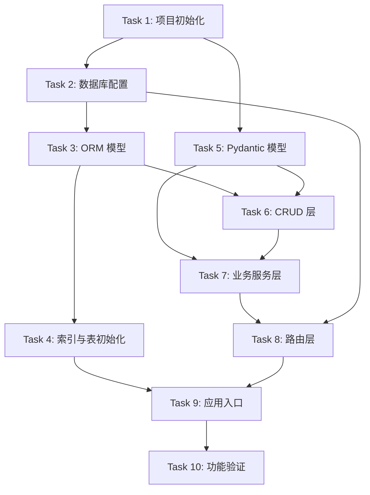

# 开发任务清单 - SD-01 RESTful 任务管理 API

> 基于 [design.md](design.md) 拆解，按依赖顺序排列，建议逐条执行。

---

## Task 1: 项目初始化与依赖配置

**目标**: 搭建 Python 项目骨架，安装并配置运行所需依赖。

**范围**: 开发环境与运行环境准备。

**步骤**:
- [ ] 在项目根目录下创建 Python 虚拟环境并激活
- [ ] 创建 `requirements.txt` 或 `pyproject.toml`，包含以下核心依赖：
  - `fastapi`
  - `uvicorn[standard]`
  - `sqlalchemy>=2.0`
  - `aiosqlite`
  - `pydantic>=2.0`
- [ ] 安装依赖并验证导入无报错
- [ ] 创建项目目录结构，建议如下：

```
task_api/
├── __init__.py
├── main.py              # FastAPI 应用入口
├── database.py          # 数据库连接与会话管理
├── models.py            # SQLAlchemy ORM 模型
├── schemas.py           # Pydantic 请求/响应模型
├── crud.py              # 数据访问层（DAO）
├── services.py          # 业务服务层
└── routers/
    ├── __init__.py
    └── tasks.py         # 任务路由端点
```

**交付物**: `task_api/` 目录结构及可正常导入的依赖环境。

**依赖**: 无

---

## Task 2: 数据库连接配置

**目标**: 配置 SQLAlchemy 2.0 异步引擎与异步会话，供后续 ORM 操作使用。

**范围**: `task_api/database.py`

**步骤**:
- [ ] 使用 `create_async_engine` 创建指向 SQLite 数据库的异步引擎（如 `sqlite+aiosqlite:///./tasks.db`）
- [ ] 使用 `async_sessionmaker` 创建 `AsyncSession` 工厂，配置 `expire_on_commit=False`
- [ ] 定义 `async def get_db_session()` 依赖生成器函数，用于在请求生命周期内提供数据库会话并在结束后关闭
- [ ] 提供初始化函数/脚本，用于在应用启动时调用 `create_all()` 建表（或使用 Alembic 等迁移工具，但本系统建议简化处理）

**交付物**: `task_api/database.py` 文件，可独立运行测试引擎与会话创建。

**依赖**: Task 1

---

## Task 3: SQLAlchemy ORM 模型定义

**目标**: 根据设计文档定义 `tasks` 数据表结构与字段约束。

**范围**: `task_api/models.py`

**步骤**:
- [ ] 创建 `Base = declarative_base()` 基类
- [ ] 定义 `Task` 模型类，包含以下字段：
  - `id`: `Integer`, `primary_key=True`, `autoincrement=True`
  - `title`: `String(200)`, `nullable=False`
  - `description`: `Text`, `nullable=True`
  - `status`: `String(20)`, `nullable=False`, `default='todo'`
  - `priority`: `String(20)`, `nullable=False`, `default='medium'`
  - `due_date`: `DateTime`, `nullable=True`
  - `created_at`: `DateTime`, `nullable=False`, `default=func.current_timestamp()`
  - `updated_at`: `DateTime`, `nullable=False`, `default=func.current_timestamp()`, `onupdate=func.current_timestamp()`
- [ ] 确保 `status` 与 `priority` 的默认值在数据库层面生效
- [ ] 添加 `__tablename__ = "tasks"`

**交付物**: `task_api/models.py` 文件，`Task` 模型可通过 SQLAlchemy 反射/创建对应表结构。

**依赖**: Task 2

---

## Task 4: 数据库索引与表初始化

**目标**: 为 `tasks` 表创建设计文档中定义的数据库索引，并在应用启动时完成表创建。

**范围**: `task_api/models.py` 补充索引，以及 `task_api/database.py` 或 `task_api/main.py` 中的启动逻辑。

**步骤**:
- [ ] 在 `Task` 模型上使用 `Index` 定义以下索引：
  - `idx_tasks_status` 作用于 `status`
  - `idx_tasks_priority` 作用于 `priority`
  - `idx_tasks_due_date` 作用于 `due_date`
  - `idx_tasks_created_at` 作用于 `created_at`
- [ ] 在 `task_api/main.py` 或独立初始化脚本中，使用 `Base.metadata.create_all(engine)` 在应用启动时异步创建表（或提供显式初始化命令）
- [ ] 验证生成的 SQLite 数据库中表与索引均已正确建立

**交付物**: 包含索引定义的 `Task` 模型，以及可运行的表初始化逻辑。

**依赖**: Task 3

---

## Task 5: Pydantic 请求/响应模型定义

**目标**: 定义所有接口的输入校验模型与输出序列化模型，确保请求/响应与数据库模型隔离。

**范围**: `task_api/schemas.py`

**步骤**:
- [ ] 定义 `TaskStatus` 枚举（`todo`, `in_progress`, `done`）与 `TaskPriority` 枚举（`low`, `medium`, `high`），使用 `StrEnum` 或 Pydantic 枚举
- [ ] 定义 `TaskBase` 基类 Schema，包含公共字段：
  - `title`: `str`, 长度约束 1~200
  - `description`: `str | None`, 最大长度 2000
  - `status`: `TaskStatus`, 默认 `TaskStatus.todo`
  - `priority`: `TaskPriority`, 默认 `TaskPriority.medium`
  - `due_date`: `datetime | None`
- [ ] 定义 `TaskCreate` 继承 `TaskBase`，用于 POST 请求体（字段全部可选的除外按基类定义）
- [ ] 定义 `TaskUpdate` 继承 `TaskBase`，所有字段均设为 `Optional`，用于 PUT/PATCH 请求体
- [ ] 定义 `TaskResponse` 继承 `TaskBase`，额外包含：
  - `id`: `int`
  - `created_at`: `datetime`
  - `updated_at`: `datetime`
  - 配置 `from_attributes=True` 以支持从 ORM 对象直接序列化
- [ ] 定义 `TaskListResponse` 包装体：
  - `items`: `list[TaskResponse]`
  - `pagination`: 包含 `page`, `page_size`, `total`, `total_pages`
- [ ] 所有 `datetime` 字段统一使用 UTC，响应格式为 ISO 8601 并带 `Z` 后缀（可通过 Pydantic 配置或自定义 JSON 编码器实现）

**交付物**: `task_api/schemas.py` 文件，包含所有 Pydantic 模型，可独立实例化与校验。

**依赖**: Task 1

---

## Task 6: 数据访问层（CRUD）实现

**目标**: 封装对 `tasks` 表的原子性数据库操作，为业务层提供纯净的异步 CRUD 接口。

**范围**: `task_api/crud.py`

**步骤**:
- [ ] 实现 `async def create_task(session: AsyncSession, task_data: TaskCreate) -> Task`：
  - 创建 `Task` ORM 实例，添加到会话并提交
  - 刷新对象以获取生成的 `id` 与时间戳
- [ ] 实现 `async def get_task(session: AsyncSession, task_id: int) -> Task | None`：
  - 根据主键查询单条记录
- [ ] 实现 `async def update_task(session: AsyncSession, task: Task, update_data: dict) -> Task`：
  - 将 `update_data` 字典中的字段动态更新到 `Task` 实例
  - 提交事务并刷新对象
- [ ] 实现 `async def delete_task(session: AsyncSession, task: Task) -> None`：
  - 删除指定 ORM 实例并提交事务
- [ ] 实现 `async def list_tasks(session: AsyncSession, **filters) -> tuple[list[Task], int]`：
  - 根据传入的过滤条件动态构建 `select(Task)` 查询
  - 支持分页（`limit`/`offset`）与单字段排序
  - 返回记录列表与总记录数（用于分页元数据）

**交付物**: `task_api/crud.py` 文件，所有函数可接受 `AsyncSession` 并执行对应数据库操作。

**依赖**: Task 3, Task 5

---

## Task 7: 业务服务层实现

**目标**: 实现业务编排逻辑与查询参数构建器，协调路由层与数据访问层。

**范围**: `task_api/services.py`

**步骤**:
- [ ] 实现 `async def create_task_service(session, task_create: TaskCreate) -> TaskResponse`：
  - 调用 `crud.create_task`，将 ORM 结果转换为 `TaskResponse`
- [ ] 实现 `async def get_task_service(session, task_id: int) -> TaskResponse`：
  - 调用 `crud.get_task`，不存在时抛出 `HTTPException(404)`
- [ ] 实现 `async def update_task_service(session, task_id: int, task_update: TaskUpdate) -> TaskResponse`：
  - 查询任务是否存在，不存在时抛出 `HTTPException(404)`
  - 将 `TaskUpdate` 中非 `None` 字段提取为字典，调用 `crud.update_task`
  - 返回 `TaskResponse`
- [ ] 实现 `async def delete_task_service(session, task_id: int) -> None`：
  - 查询任务是否存在，不存在时抛出 `HTTPException(404)`
  - 调用 `crud.delete_task`
- [ ] 实现 `async def list_tasks_service(session, query_params) -> TaskListResponse`：
  - 解析并校验查询参数（`status`, `priority`, `due_date_from`, `due_date_to`, `created_at_from`, `created_at_to`, `page`, `page_size`, `sort_by`, `sort_order`）
  - 构建过滤条件：
    - 同字段多值采用 OR 逻辑（如 `status=todo,in_progress`）
    - 不同字段间采用 AND 逻辑
    - 时间范围字段使用包含边界
  - 校验 `sort_by` 是否在允许字段列表中，不在则抛出 `HTTPException(422)`
  - 校验 `page` >= 1，`page_size` 在 1~100 之间，否则抛出 `HTTPException(422)`
  - 调用 `crud.list_tasks` 获取数据与总数
  - 组装 `TaskListResponse` 并返回

**交付物**: `task_api/services.py` 文件，所有服务函数可独立测试。

**依赖**: Task 5, Task 6

---

## Task 8: FastAPI 路由层实现

**目标**: 定义所有 HTTP 端点，绑定请求/响应模型、依赖注入与服务层调用。

**范围**: `task_api/routers/tasks.py`

**步骤**:
- [ ] 创建 `router = APIRouter(prefix="/api/v1/tasks", tags=["tasks"])`
- [ ] 实现 **POST** `/api/v1/tasks`：
  - 接收 `task_create: TaskCreate`
  - 注入 `session: AsyncSession = Depends(get_db_session)`
  - 调用 `create_task_service`，返回 `TaskResponse`，状态码 `201`
- [ ] 实现 **GET** `/api/v1/tasks/{task_id}`：
  - 接收路径参数 `task_id: int`
  - 注入 `session`
  - 调用 `get_task_service`，返回 `TaskResponse`
- [ ] 实现 **PUT** `/api/v1/tasks/{task_id}`：
  - 接收 `task_id: int` 与 `task_update: TaskUpdate`
  - 注入 `session`
  - 调用 `update_task_service`，返回 `TaskResponse`
  - PUT 语义下所有字段均可传递（包括保持不变的字段）
- [ ] 实现 **PATCH** `/api/v1/tasks/{task_id}`：
  - 与 PUT 共享同一处理函数或单独实现
  - PATCH 语义下仅传递需要修改的字段
- [ ] 实现 **DELETE** `/api/v1/tasks/{task_id}`：
  - 接收 `task_id: int`
  - 注入 `session`
  - 调用 `delete_task_service`，返回空响应，状态码 `204`
- [ ] 实现 **GET** `/api/v1/tasks`：
  - 接收所有列表查询参数作为 `Query(...)` 依赖
  - 注入 `session`
  - 调用 `list_tasks_service`，返回 `TaskListResponse`
- [ ] 确保所有端点的响应模型、状态码与错误处理符合设计文档要求

**交付物**: `task_api/routers/tasks.py` 文件，所有端点可通过 HTTP 请求访问。

**依赖**: Task 2, Task 5, Task 7

---

## Task 9: FastAPI 应用主入口配置

**目标**: 组装 FastAPI 应用实例，注册路由，配置自动文档与全局异常处理。

**范围**: `task_api/main.py`

**步骤**:
- [ ] 创建 `app = FastAPI()` 实例，配置：
  - `title="Task Management API"`
  - `version="1.0.0"`
  - `docs_url="/api/v1/docs"`
  - `openapi_url="/api/v1/openapi.json"`
- [ ] 使用 `app.include_router(tasks.router)` 注册任务路由
- [ ] 配置应用生命周期事件（如 `lifespan`），在启动时异步调用 `Base.metadata.create_all(engine)` 完成表初始化（如选择此策略）
- [ ] 确保 `uvicorn` 启动命令可正常运行应用（如 `uvicorn task_api.main:app --reload`）
- [ ] 验证通过 `/api/v1/docs` 可访问 Swagger UI，且 `/api/v1/openapi.json` 可正常返回

**交付物**: `task_api/main.py` 文件及可运行的 FastAPI 服务。

**依赖**: Task 4, Task 8

---

## Task 10: 功能验证与接口检查

**目标**: 手动验证所有 API 端点行为符合设计文档与需求规格，确保数据流完整通顺。

**范围**: 端到端接口测试（手动或脚本）。

**步骤**:
- [ ] 启动应用服务，确认无报错
- [ ] 通过 Swagger UI 或 curl/Postman 执行以下验证：
  - **创建任务**: POST `/api/v1/tasks`，验证 `201` 返回且包含 `id`, `created_at`, `updated_at`
  - **获取详情**: GET `/api/v1/tasks/{id}`，验证 `200` 与 `404`
  - **更新任务**: PUT 与 PATCH `/api/v1/tasks/{id}`，验证字段更新与 `updated_at` 刷新
  - **删除任务**: DELETE `/api/v1/tasks/{id}`，验证 `204` 与后续 `404`
  - **列表查询**: GET `/api/v1/tasks`，验证：
    - 无过滤返回分页数据
    - `status` 与 `priority` 多值过滤（OR 逻辑）
    - 时间范围过滤
    - 分页参数 `page`/`page_size`
    - 排序参数 `sort_by`/`sort_order`
    - 非法排序字段返回 `422`
    - 分页越界返回 `422`
  - **校验错误**: 提交非法字段，验证 `422` 响应包含 `loc`/`msg`/`type` 结构
- [ ] 验证数据库中 `tasks` 表与四个索引均已存在
- [ ] 确认所有日期时间字段以 UTC 存储，响应中带 `Z` 后缀

**交付物**: 验证记录或简单的验证脚本，确认所有接口与设计一致。

**依赖**: Task 9

---

## 任务依赖关系图



---

## 附录：设计要点覆盖检查表

| 设计章节 | 关键内容 | 覆盖任务 |
|---------|---------|---------|
| 2.1 整体架构 | FastAPI + Pydantic + SQLAlchemy + SQLite 分层 | Task 1~9 |
| 2.2.1 表示层 | FastAPI 路由、Pydantic 校验、自动文档 | Task 5, Task 8, Task 9 |
| 2.2.2 业务层 | 服务层、查询构建器 | Task 7 |
| 2.2.3 数据访问层 | SQLAlchemy 2.0 AsyncSession、CRUD | Task 2, Task 6 |
| 2.2.4 数据层 | SQLite 文件数据库 | Task 2, Task 4 |
| 3.3 API 设计 | 5 个端点，状态码与参数规格 | Task 8 |
| 3.4 错误响应 | 422/404/400 统一结构 | Task 7, Task 8 |
| 4.2.1 任务表 | 8 个字段及约束 | Task 3 |
| 4.2.2 索引设计 | 4 个普通索引 | Task 4 |
| 4.3 数据一致性 | 异步事务、物理删除 | Task 6 |
| 5. 设计决策 | PUT+PATCH、UTC、分页包装体等 | Task 5, Task 7, Task 8 |
