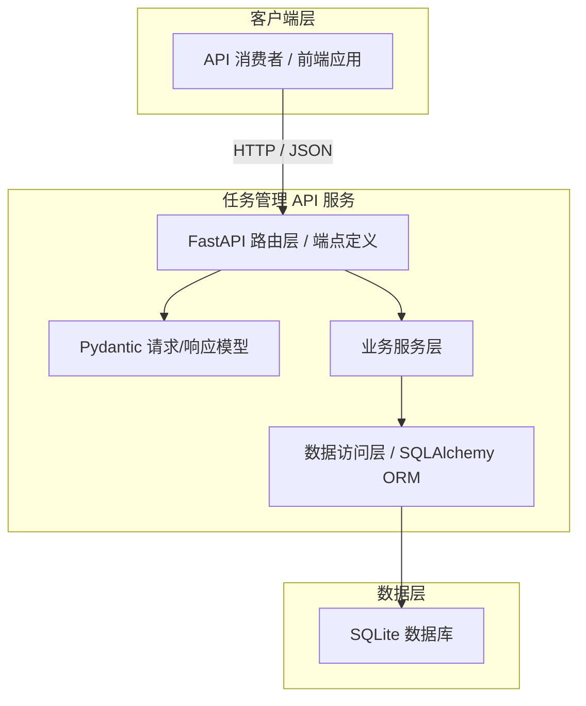

# Design: SD-01 RESTful 任务管理 API

> 基于[`specs.md`](specs.md) 进行系统架构与详细设计。

---

## 1. 架构概览

本系统采用单体分层架构，以 FastAPI 为核心 Web 框架，通过 Pydantic 进行请求/响应模型的序列化与校验，通过 SQLAlchemy 2.0 异步会话操作 SQLite 数据库。整体架构强调单一职责、接口隔离与依赖倒置，确保各层边界清晰，便于后续扩展为多用户系统或迁移至其他数据库后端。



---

## 2. 模块划分

### Module 1: 路由模块 (Router)

- **职责**: 定义所有 HTTP 端点，负责请求接收、参数解析、依赖注入与响应返回。将 HTTP 协议细节与业务逻辑解耦。
- **接口**:
  - `POST /api/v1/tasks` —— 创建任务
  - `GET /api/v1/tasks` —— 获取任务列表（支持过滤、分页、排序）
  - `GET /api/v1/tasks/{task_id}` —— 获取任务详情
  - `PUT /api/v1/tasks/{task_id}` —— 全量更新任务
  - `PATCH /api/v1/tasks/{task_id}` —— 部分更新任务
  - `DELETE /api/v1/tasks/{task_id}` —— 删除任务
- **技术栈**: FastAPI `APIRouter`

### Module 2: 模型模块 (Schemas & ORM Models)

- **职责**: 定义 Pydantic 请求/响应模型（Schema）与 SQLAlchemy ORM 模型，确保外部接口与内部数据结构的隔离。Pydantic 负责输入校验与输出序列化；SQLAlchemy 负责数据库表映射。
- **接口 / 关键类**:
  - `TaskStatus` (StrEnum) —— `todo` / `in_progress` / `done`
  - `TaskPriority` (StrEnum) —— `low` / `medium` / `high`
  - `TaskBase` —— 公共字段基类 Schema
  - `TaskCreate` —— POST 请求体模型
  - `TaskUpdate` —— PUT/PATCH 请求体模型（所有字段 Optional）
  - `TaskResponse` —— 响应体模型（含 `id`, `created_at`, `updated_at`）
  - `TaskListResponse` —— 列表包装体（`items` + `pagination`）
  - `Task` (ORM) —— SQLAlchemy 声明式模型，映射 `tasks` 表
- **技术栈**: Pydantic v2, SQLAlchemy 2.0

### Module 3: 业务服务模块 (Services)

- **职责**: 封装任务 CRUD 与列表查询的业务逻辑，协调路由层与数据访问层之间的调用。负责查询参数解析、过滤条件构建、分页元数据计算及业务异常抛送。
- **接口 / 关键函数**:
  - `create_task_service(session, task_create: TaskCreate) -> TaskResponse`
  - `get_task_service(session, task_id: int) -> TaskResponse`
  - `update_task_service(session, task_id: int, task_update: TaskUpdate) -> TaskResponse`
  - `delete_task_service(session, task_id: int) -> None`
  - `list_tasks_service(session, query_params) -> TaskListResponse`
- **技术栈**: Python 标准库

### Module 4: 数据访问模块 (CRUD / DAO)

- **职责**: 封装对 `tasks` 表的原子性数据库操作，为业务层提供纯净的异步 CRUD 接口。所有操作基于 SQLAlchemy `AsyncSession`，确保异步非阻塞。
- **接口 / 关键函数**:
  - `create_task(session, task_data: TaskCreate) -> Task`
  - `get_task(session, task_id: int) -> Task | None`
  - `update_task(session, task: Task, update_data: dict) -> Task`
  - `delete_task(session, task: Task) -> None`
  - `list_tasks(session, **filters) -> tuple[list[Task], int]`（返回记录列表与总记录数）
- **技术栈**: SQLAlchemy 2.0 `AsyncSession`

### Module 5: 数据库与会话模块 (Database)

- **职责**: 管理异步数据库引擎创建、会话工厂配置与依赖注入生成器，供 FastAPI 的 `Depends` 在请求生命周期内自动分配与回收会话。
- **接口 / 关键函数**:
  - `engine = create_async_engine("sqlite+aiosqlite:///./tasks.db")`
  - `async_session = async_sessionmaker(engine, expire_on_commit=False)`
  - `get_db_session() -> AsyncGenerator[AsyncSession, None]`
  - `init_db()` —— 应用启动时调用 `create_all()` 建表
- **技术栈**: SQLAlchemy 2.0, aiosqlite

---

## 3. 数据模型

### 3.1 数据库表结构（tasks）

| 字段名 | 数据类型 | 约束 | 默认值 | 说明 |
|--------|---------|------|--------|------|
| `id` | INTEGER | PRIMARY KEY, AUTOINCREMENT | — | 唯一标识，不可修改 |
| `title` | VARCHAR(200) | NOT NULL | — | 任务标题 |
| `description` | TEXT | NULL | NULL | 任务详细描述，最大 2000 字符 |
| `status` | VARCHAR(20) | NOT NULL | `'todo'` | 枚举：`todo`/`in_progress`/`done` |
| `priority` | VARCHAR(20) | NOT NULL | `'medium'` | 枚举：`low`/`medium`/`high` |
| `due_date` | DATETIME | NULL | NULL | 截止时间，UTC 存储 |
| `created_at` | DATETIME | NOT NULL | CURRENT_TIMESTAMP | 创建时间戳 |
| `updated_at` | DATETIME | NOT NULL | CURRENT_TIMESTAMP | 最后更新时间戳，每次更新自动刷新 |

### 3.2 索引设计

| 索引名称 | 字段 | 类型 | 说明 |
|---------|------|------|------|
| `idx_tasks_status` | `status` | 普通索引 | 加速状态过滤查询 |
| `idx_tasks_priority` | `priority` | 普通索引 | 加速优先级过滤查询 |
| `idx_tasks_due_date` | `due_date` | 普通索引 | 加速截止时间范围查询 |
| `idx_tasks_created_at` | `created_at` | 普通索引 | 加速创建时间范围查询与默认排序 |

### 3.3 分页响应包装体

```json
{
  "items": [...],
  "pagination": {
    "page": 1,
    "page_size": 20,
    "total": 150,
    "total_pages": 8
  }
}
```

---

## 4. 技术选型说明

| 技术选型 | 说明 | 选型理由 |
|---------|------|---------|
| **FastAPI** | Python 异步 Web 框架 | 原生支持异步、自动 OpenAPI 文档生成、依赖注入机制成熟，可显著降低路由层与校验层代码量 |
| **Pydantic v2** | 数据验证与序列化库 | 与 FastAPI 深度集成，提供高性能的模型校验与 JSON 序列化；支持 `from_attributes` 直接从 ORM 映射 |
| **SQLAlchemy 2.0** | ORM 与数据库抽象层 | 2.0 版本提供原生异步支持（`AsyncSession`），类型注解友好，声明式模型语法清晰 |
| **aiosqlite** | SQLite 异步驱动 | 轻量级文件数据库，零部署成本，适合单用户原型及小规模场景；与 SQLAlchemy 异步引擎无缝兼容 |
| **SQLite** | 关系型数据库 | 满足当前单用户场景下的 ACID 需求，无需独立数据库进程，降低运维复杂度 |

### 未选方案说明
- **Django / Flask**: FastAPI 在异步性能、自动文档与类型安全方面优于 Flask；Django 过于重型，不符合“轻量级 API”定位。
- **PostgreSQL / MySQL**: 当前需求明确为单用户、轻量级，SQLite 足以支撑；后续如需多租户或高并发，可平滑迁移至 PostgreSQL（SQLAlchemy 抽象层保证低切换成本）。
- **Tortoise ORM / Prisma**: SQLAlchemy 生态更成熟，社区文档与排障资源更丰富，且团队技术栈已对其有积累。

---

## 5. 设计决策记录 (Design Decisions)

| 决策项 | 决策内容 | 理由 |
|--------|---------|------|
| 用户认证机制 | 当前版本不提供用户认证 | 需求明确为单用户开放 API，降低复杂度 |
| 更新接口方式 | 同时支持 PUT 全量替换与 PATCH 部分更新 | 提供更灵活的客户端集成方式 |
| 删除策略 | 采用物理删除 | 需求定位轻量级，物理删除实现简单直接 |
| 分页响应结构 | 采用 `items` + `pagination` JSON 包装体 | 结构清晰，便于前端统一解析 |
| 排序能力 | 仅支持单字段排序 | 满足当前需求，避免过度设计 |
| 全文搜索 | 暂不实现 | 需求中标记为可后续扩展，当前版本聚焦核心 CRUD |
| 错误响应格式 | 采用 FastAPI / Pydantic 默认结构 | 降低开发成本，与框架生态保持一致 |
| 日期时间处理 | 统一使用 UTC 存储并在响应中附带 `Z` 后缀 | 避免时区歧义，符合国际标准 |

---

> **文档版本**: v1.0  
> **更新时间**: 2026-05-17
