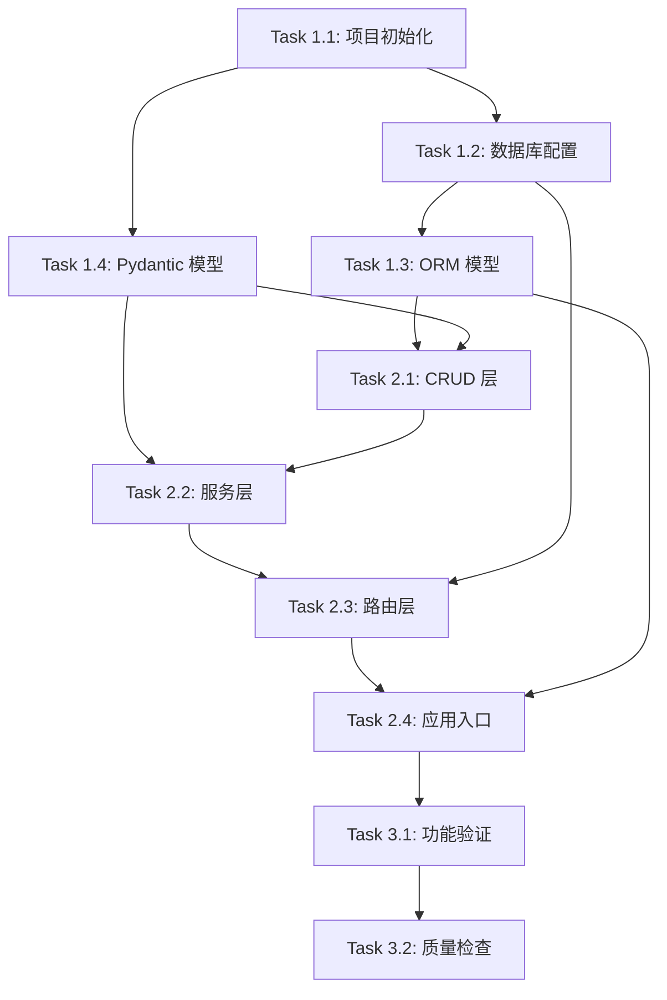

# Tasks: SD-01 RESTful 任务管理 API

> 基于 [`specs.md`](specs.md) 与 [`design.md`](design.md) 拆解，按依赖顺序与阶段划分排列，建议逐条执行并提交。

---

## Phase 1: 基础架构

### Task 1.1: 项目初始化与依赖配置
- [ ] 创建 Python 虚拟环境并激活。
- [ ] 创建 `requirements.txt`（或 `pyproject.toml`），包含以下核心依赖：
  - `fastapi`
  - `uvicorn[standard]`
  - `sqlalchemy>=2.0`
  - `aiosqlite`
  - `pydantic>=2.0`
- [ ] 安装依赖并验证导入无报错。
- [ ] 创建项目目录结构：
  ```
  task_api/
├── __init__.py
├── main.py              # FastAPI 应用入口 + lifespan 生命周期
├── database.py          # 异步 SQLite 引擎 + 会话管理 + init_db
├── models.py            # Task ORM 模型 + 4 个数据库索引
├── schemas.py           # Pydantic 枚举/请求/响应模型 + UTC Z 后缀序列化
├── crud.py              # 数据访问层：CRUD + 动态查询/分页/排序
├── services.py          # 业务服务层：参数校验 + 404/422 异常处理
└── routers/
    ├── __init__.py
    └── tasks.py          # 6 个 RESTful 端点

  ```

### Task 1.2: 数据库连接配置
- [ ] 使用 `create_async_engine` 创建指向 SQLite 的异步引擎（`sqlite+aiosqlite:///./tasks.db`）。
- [ ] 使用 `async_sessionmaker` 创建 `AsyncSession` 工厂，配置 `expire_on_commit=False`。
- [ ] 定义 `async def get_db_session()` 依赖生成器函数，用于在请求生命周期内提供数据库会话并在结束后关闭。
- [ ] 提供 `init_db()` 函数，在应用启动时异步调用 `create_all()` 建表。

### Task 1.3: SQLAlchemy ORM 模型与索引定义
- [ ] 创建 `Base = declarative_base()` 基类。
- [ ] 定义 `Task` 模型类，包含全部 8 个字段及约束（见 [`design.md`](design.md) 数据模型章节）。
- [ ] 使用 `Index` 定义 4 个数据库索引：`idx_tasks_status`、`idx_tasks_priority`、`idx_tasks_due_date`、`idx_tasks_created_at`。
- [ ] 验证生成的 SQLite 数据库中表与索引均已正确建立。

### Task 1.4: Pydantic 请求/响应模型定义
- [ ] 定义 `TaskStatus` 与 `TaskPriority` 枚举（StrEnum）。
- [ ] 定义 `TaskBase`、`TaskCreate`、`TaskUpdate`、`TaskResponse`、`TaskListResponse` 模型。
- [ ] 配置 `TaskResponse.from_attributes = True` 以支持从 ORM 对象直接序列化。
- [ ] 所有 `datetime` 字段统一使用 UTC，响应格式为 ISO 8601 并带 `Z` 后缀。

---

## Phase 2: 核心功能

### Task 2.1: 数据访问层（CRUD）实现
- [ ] 实现 `create_task(session, task_data) -> Task`：创建实例、添加会话、提交、刷新。
- [ ] 实现 `get_task(session, task_id) -> Task | None`：按主键查询单条记录。
- [ ] 实现 `update_task(session, task, update_data) -> Task`：动态更新字段、提交、刷新。
- [ ] 实现 `delete_task(session, task) -> None`：删除实例并提交。
- [ ] 实现 `list_tasks(session, **filters) -> tuple[list[Task], int]`：动态构建查询、支持分页与排序、返回记录列表与总记录数。

### Task 2.2: 业务服务层实现
- [ ] 实现 `create_task_service(session, task_create) -> TaskResponse`。
- [ ] 实现 `get_task_service(session, task_id) -> TaskResponse`：不存在时抛出 `HTTPException(404)`。
- [ ] 实现 `update_task_service(session, task_id, task_update) -> TaskResponse`：提取非 `None` 字段、调用 CRUD、不存在时抛 404。
- [ ] 实现 `delete_task_service(session, task_id) -> None`：不存在时抛 404。
- [ ] 实现 `list_tasks_service(session, query_params) -> TaskListResponse`：
  - 解析过滤参数（AND 跨字段、OR 同字段多值）。
  - 校验 `page` >= 1、`page_size` 在 1~100 之间，否则抛 422。
  - 校验 `sort_by` 在允许列表中，否则抛 422。
  - 组装 `TaskListResponse` 返回。

### Task 2.3: FastAPI 路由层实现
- [ ] 创建 `router = APIRouter(prefix="/api/v1/tasks", tags=["tasks"])`。
- [ ] 实现 **POST** `/api/v1/tasks`：接收 `TaskCreate`，注入 `session`，调用 `create_task_service`，返回 `TaskResponse`，状态码 `201`。
- [ ] 实现 **GET** `/api/v1/tasks/{task_id}`：接收 `task_id: int`，调用 `get_task_service`，返回 `TaskResponse`。
- [ ] 实现 **PUT** `/api/v1/tasks/{task_id}`：全量更新，接收 `TaskUpdate`，调用 `update_task_service`。
- [ ] 实现 **PATCH** `/api/v1/tasks/{task_id}`：部分更新，与 PUT 共享处理逻辑或单独实现。
- [ ] 实现 **DELETE** `/api/v1/tasks/{task_id}`：接收 `task_id: int`，调用 `delete_task_service`，返回空响应，状态码 `204`。
- [ ] 实现 **GET** `/api/v1/tasks`：接收所有列表查询参数作为 `Query(...)`，调用 `list_tasks_service`，返回 `TaskListResponse`。

### Task 2.4: FastAPI 应用主入口配置
- [ ] 创建 `app = FastAPI(title="Task Management API", version="1.0.0", docs_url="/api/v1/docs", openapi_url="/api/v1/openapi.json")`。
- [ ] 使用 `app.include_router(tasks.router)` 注册任务路由。
- [ ] 配置应用生命周期事件（`lifespan`），在启动时异步调用 `init_db()` 完成表初始化。
- [ ] 确保 `uvicorn task_api.main:app --reload` 可正常运行。
- [ ] 验证 `/api/v1/docs` 可访问 Swagger UI，`/api/v1/openapi.json` 可正常返回。

---

## Phase 3: 测试与优化

### Task 3.1: 功能验证与接口检查
- [ ] 启动应用服务，确认无报错。
- [ ] 通过 Swagger UI 或 curl/Postman 执行端到端验证：
  - [ ] **创建任务**: POST `/api/v1/tasks`，验证 `201` 返回且包含 `id`, `created_at`, `updated_at`。
  - [ ] **获取详情**: GET `/api/v1/tasks/{id}`，验证 `200` 与 `404`。
  - [ ] **更新任务**: PUT 与 PATCH `/api/v1/tasks/{id}`，验证字段更新与 `updated_at` 刷新。
  - [ ] **删除任务**: DELETE `/api/v1/tasks/{id}`，验证 `204` 与后续 `404`。
  - [ ] **列表查询**: GET `/api/v1/tasks`，验证：
    - [ ] 无过滤返回分页数据。
    - [ ] `status` 与 `priority` 多值过滤（OR 逻辑）。
    - [ ] 时间范围过滤。
    - [ ] 分页参数 `page`/`page_size`。
    - [ ] 排序参数 `sort_by`/`sort_order`。
    - [ ] 非法排序字段返回 `422`。
    - [ ] 分页越界返回 `422`。
  - [ ] **校验错误**: 提交非法字段，验证 `422` 响应包含 `loc`/`msg`/`type` 结构。
- [ ] 验证数据库中 `tasks` 表与四个索引均已存在。
- [ ] 确认所有日期时间字段以 UTC 存储，响应中带 `Z` 后缀。

### Task 3.2: 代码质量与文档同步检查
- [ ] 确认所有 Specs 场景在代码中均有对应实现。
- [ ] 确认代码风格统一（PEP 8），无严重 lint 警告。
- [ ] 确认 Swagger 文档中的模型、枚举、必填标记与 [`specs.md`](specs.md) 一致。
- [ ] 更新 README（如需要），说明启动命令与依赖安装方式。

---

## 附录：任务依赖关系图



---

> **文档版本**: v1.0  
> **更新时间**: 2026-05-17
